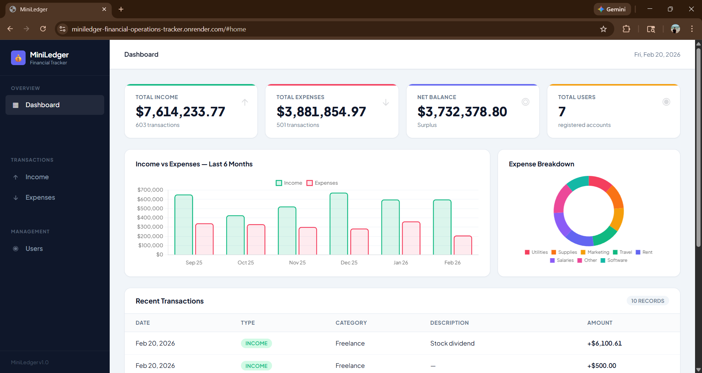
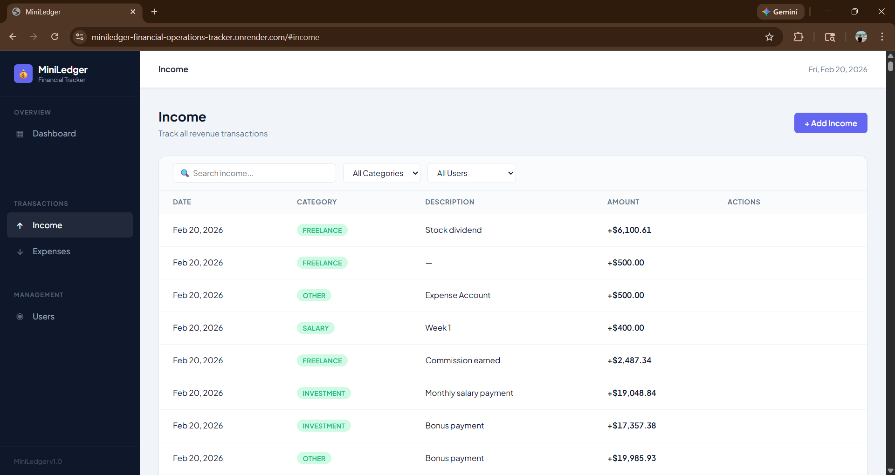
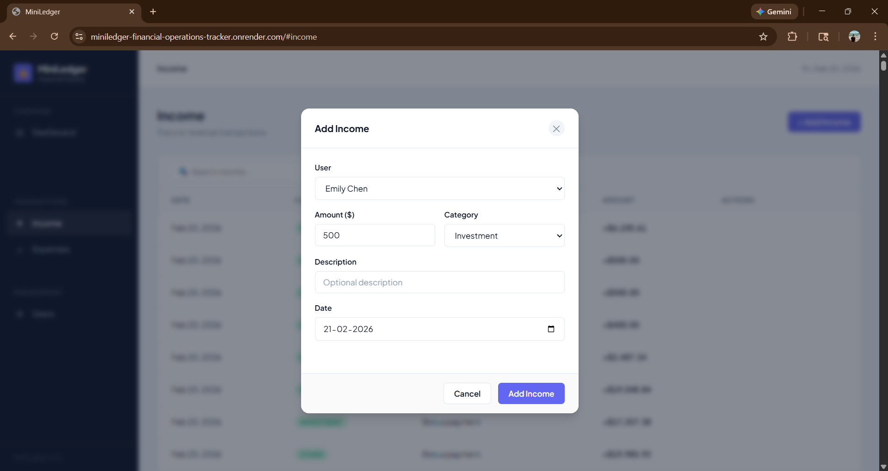
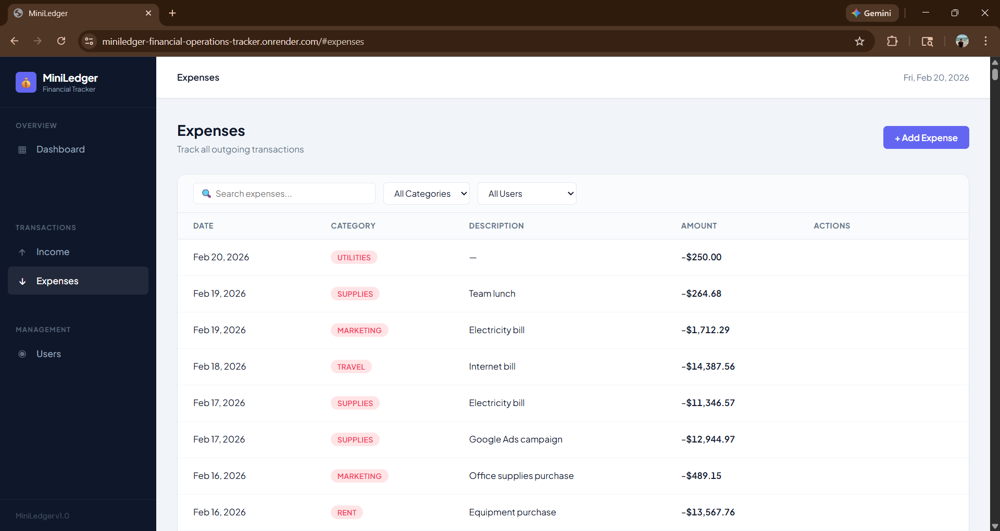
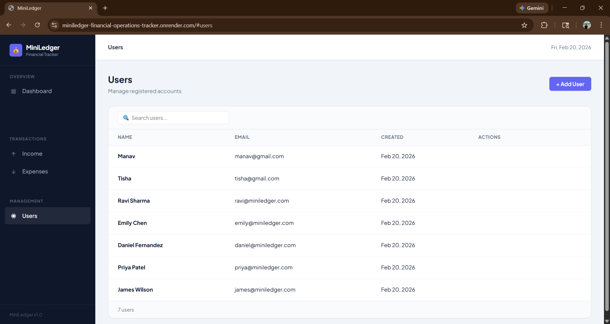

# MiniLedger - Design Document

**CS5610 Web Development · Spring 2026**  
**Team:** Manav Kaneria · Tisha Anil Patel  
**Instructor:** Prof. John Alexis Guerra Gomez

---

## 1. Project Description

### Overview

MiniLedger is a browser-based financial operations platform designed for small businesses, freelancers, and independent operators who need a structured yet lightweight way to track their financial activity. It serves as a practical alternative to complex accounting software for users who need the core functionality of recording income, tracking expenses, and understanding their financial position at a glance.

The application provides real-time financial summaries, category-based filtering, 6-month trend visualization, and complete CRUD operations on both income and expense transactions all rendered entirely on the client side using Vanilla ES6 modules with no page reloads.

### Problem Statement

Small business owners and freelancers face a common set of financial tracking challenges:

- Manual spreadsheet tracking is error-prone and offers no real-time summary
- Enterprise accounting software is expensive, complex, and requires significant onboarding
- Existing lightweight tools lack visual reporting or meaningful filtering
- Most solutions require accounting expertise to operate effectively

MiniLedger addresses these gaps with a clean, intuitive interface backed by a fast REST API and MongoDB powered reporting.

### Solution

MiniLedger delivers the following core capabilities in a single-page application:

- Real-time dashboard with income, expense, and balance summary cards
- 6-month income vs. expense trend bar chart and expense category doughnut chart
- Full CRUD operations on income and expense transactions via modal forms
- Live search and multi-filter (category + user) on all transaction tables
- User management with registration, editing, and deletion
- Clean fintech grade UI with sidebar navigation and sticky topbar

### Technical Architecture

| Layer      | Technology                                          |
| ---------- | --------------------------------------------------- |
| Runtime    | Node.js v18+                                        |
| Backend    | Express.js (ES Modules only - no require())         |
| Database   | MongoDB Atlas (native driver - no Mongoose)         |
| Frontend   | Vanilla ES6 Modules, hash-based client-side routing |
| Charts     | Chart.js (CDN)                                      |
| Styling    | Plain CSS Modules (one file per component)          |
| Linting    | ESLint v9 (flat config)                             |
| Formatting | Prettier                                            |
| Deployment | Render (Node.js web service)                        |

---

## 2. User Personas

### Persona 1 - Ravi Sharma · Small Manufacturing Business Owner

|                  |                                                                                                                                                      |
| ---------------- | ---------------------------------------------------------------------------------------------------------------------------------------------------- |
| **Goal**         | Track daily purchases, sales, and cash flow without hiring an accountant                                                                             |
| **Pain Point**   | Manages all financial entries in Excel spreadsheets. Spends 2–3 hours per week reconciling data manually, often discovering errors only at month-end |
| **Tech Comfort** | Low - needs simple, fast UI with no accounting jargon                                                                                                |

**Story:** Ravi runs a small parts manufacturing unit with 8 employees. Every morning he records material purchases and every evening he logs sales. He needs a system that lets him enter a transaction in under 30 seconds and immediately see whether he ended the day in profit or loss. He has no accounting background he just wants income in, expenses out, and a clear balance.

---

### Persona 2 - Emily Chen · Freelance Designer & Consultant

|                  |                                                                                                                                                                      |
| ---------------- | -------------------------------------------------------------------------------------------------------------------------------------------------------------------- |
| **Goal**         | Track income from multiple clients and control personal business expenses by category                                                                                |
| **Pain Point**   | Mixes personal and business expenses, making tax time stressful. No clear picture of actual monthly profit after software subscriptions, travel, and equipment costs |
| **Tech Comfort** | High - comfortable with web tools, wants speed and efficiency                                                                                                        |

**Story:** Emily works with 4–5 clients simultaneously across design and UX consulting. She invoices monthly but gets paid irregularly. She needs to quickly see which client generated the most income this quarter and how much she spent on software tools vs. travel. She doesn't want to spend time learning accounting software she wants to open the app, log a transaction, and move on.

---

### Persona 3 - Daniel Fernandez · Early-Stage Startup Founder

|                  |                                                                                                                                          |
| ---------------- | ---------------------------------------------------------------------------------------------------------------------------------------- |
| **Goal**         | Maintain clean financial records for investor reporting and understand burn rate at a glance                                             |
| **Pain Point**   | Screenshots bank transactions and pastes them into Notion, a process that breaks down at month-end. Investors have asked for a basic P&L |
| **Tech Comfort** | Medium - understands software but not accounting                                                                                         |

**Story:** Daniel is 6 months into building his startup with 2 co-founders. Investors have asked for a basic financial summary before the next check-in. He needs a tool where he can quickly input all company transactions, assign them to categories, and generate a summary he can share with investors. He values speed and visual clarity above all else.

---

## 3. User Stories

### User Management

**US-01** · As a user, I want to register a new account so that I can start tracking my financial records under my own identity.

> Acceptance: Registration form accepts name, email, and password. Duplicate emails are rejected. Successful registration adds the user to the users table immediately.

**US-02** · As a user, I want to view a list of all registered users so that I can see who is using the system.

> Acceptance: Users page shows a searchable table with name, email, and registration date. Search filters results in real time.

**US-03** · As a user, I want to edit my account name and email so that I can keep my profile up to date.

> Acceptance: Edit button opens a modal with pre-filled current values. Saving updates the record in MongoDB and refreshes the table immediately.

**US-04** · As a user, I want to delete my account so that I can remove my data from the system.

> Acceptance: Delete button shows a confirmation modal before permanently removing the user.

---

### Income Tracking - Manav Kaneria

**US-05** · As a user, I want to record an income transaction with amount, category, description, and date so that I can track all revenue sources.

> Acceptance: Add Income button opens a modal form. All required fields are validated before submission. Record appears immediately in the income table.

**US-06** · As a freelancer, I want to filter income records by category and user so that I can understand which revenue streams are performing best.

> Acceptance: Category and user dropdowns filter the income table independently and in combination. Record count and total update dynamically.

**US-07** · As a user, I want to search income records by description or category so that I can quickly find a specific transaction.

> Acceptance: Search input filters results in real time as the user types, working alongside active filters simultaneously.

**US-08** · As a business owner, I want to edit an income record so that I can correct a data entry mistake.

> Acceptance: Edit button opens a pre-filled modal. Saving updates only the changed fields. Table refreshes with updated values.

**US-09** · As a user, I want to delete an income record so that I can remove an incorrectly entered transaction.

> Acceptance: Delete button shows a confirmation modal. Record is permanently removed on confirmation.

---

### Expense Tracking - Tisha Anil Patel

**US-10** · As a user, I want to record an expense transaction with amount, category, description, and date so that I can monitor outgoing payments.

> Acceptance: Add Expense button opens a modal form with 8 expense categories. Required fields are validated. Record appears immediately in the expense table.

**US-11** · As a startup founder, I want to filter expenses by category and user so that I can understand where the company is spending most.

> Acceptance: Category and user filters work independently and together. Totals update to reflect the filtered subset.

**US-12** · As a freelancer, I want to search expense records so that I can quickly find a specific subscription or travel expense.

> Acceptance: Search filters the expense table in real time across category and description fields.

**US-13** · As a user, I want to edit an expense record so that I can correct a wrong amount or category.

> Acceptance: Edit opens a pre-filled modal. Only modified fields are sent to the API. Table refreshes with updated values.

**US-14** · As a user, I want to delete an expense record so that I can remove a duplicate or incorrectly entered transaction.

> Acceptance: Confirmation modal prevents accidental deletion. Record removed from MongoDB on confirm.

---

### Dashboard & Reporting - Tisha Anil Patel

**US-15** · As a user, I want to see a dashboard with my total income, total expenses, and net balance so that I can understand my financial position at a glance.

> Acceptance: Dashboard shows 4 summary cards: Total Income, Total Expenses, Net Balance (surplus/deficit), and Total Users.

**US-16** · As a business owner, I want to see a bar chart comparing income vs. expenses over the last 6 months so that I can identify trends in my cash flow.

> Acceptance: Bar chart renders on dashboard load using Chart.js. Two series: income (green) and expenses (rose). Handles months with zero transactions.

**US-17** · As a freelancer, I want to see a breakdown of my expenses by category in a chart so that I can identify my largest cost centers.

> Acceptance: Doughnut chart shows expense distribution by category with distinct colors per category.

**US-18** · As a user, I want to see my 10 most recent transactions on the dashboard so that I can quickly review recent activity without navigating away.

> Acceptance: Recent transactions table shows combined income and expense records sorted by date descending. Type badge visually distinguishes income from expense.

---

## 4. Design Mockups

### 4.1 Dashboard

The dashboard is the landing page of the application. It displays four summary stat cards at the top (Total Income, Total Expenses, Net Balance, Total Users), followed by two Chart.js visualizations - a bar chart showing income vs. expenses over the last 6 months, and a doughnut chart breaking down expenses by category. Below the charts is a recent transactions table combining both income and expense records sorted by date.

---

### 4.2 Income Page

The income page displays all income transactions in a data table. A toolbar above the table provides a live search input, a category filter dropdown, and a user filter dropdown. All three filters work simultaneously. The footer of the table shows the total record count and the sum of all visible income amounts. The "+ Add Income" button in the page header opens the add income modal.

---

### 4.3 Add Income Modal

Clicking "+ Add Income" opens a modal overlay. The form includes a user selector, amount input, category dropdown (Salary, Freelance, Investment, Business, Other), description text input, and a date picker pre-filled with today's date. All required fields are validated before the record is submitted. The modal closes and the table refreshes on successful save.

---

### 4.4 Edit Income Modal

Hovering over any row in the income table reveals Edit and Delete action buttons. Clicking Edit opens a pre-filled modal with the current values of the record. Only the changed fields are sent to the API on save. The table refreshes immediately after a successful update.

---

### 4.5 Expenses Page

The expenses page mirrors the income page in structure. It displays all expense transactions with the same search, category filter, and user filter toolbar. Expense amounts are shown in red to visually distinguish outgoing payments from income. The footer shows the total expense count and sum for the current filtered view.

---

### 4.6 Users Page

The users page lists all registered accounts in a searchable table showing name, email, and registration date. The live search filters by both name and email simultaneously. The "+ Add User" button opens a registration modal. Edit and Delete actions appear on row hover.

---

## 5. Division of Work

### Manav Kaneria - Full Stack

- Backend: `server.js`, `src/db/connection.js`, `src/routes/users.js`, `src/routes/income.js`
- Frontend: `app.js`, `modules/api.js`, `modules/router.js`, `modules/nav.js`, `modules/modal.js`, `modules/usersPage.js`, `modules/incomePage.js`, `modules/homePage.js`
- CSS: All 7 CSS modules
- Infrastructure: MongoDB setup, ESLint/Prettier config, seed script, Render deployment

### Tisha Anil Patel - Full Stack

- Backend: `src/routes/expenses.js`
- Frontend: `modules/expensesPage.js`
- Reporting: Dashboard chart aggregation logic in `homePage.js`
- Documentation: Design document, demo video, Google Form submission
